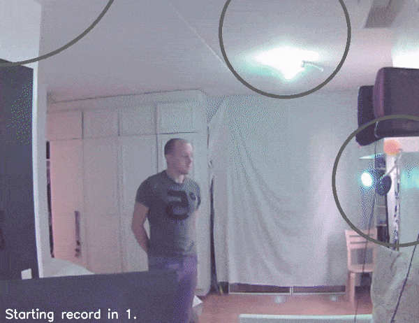
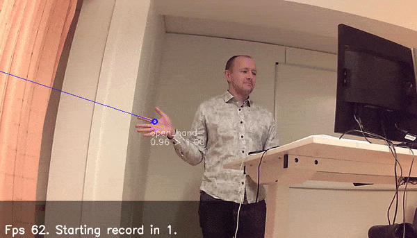

# Hands AI

Recognizing hands and point direction in images.

## Usage

- Requires Python>3.6, OpenCV2>3.4, Torch>1, Fastai lib
- Download pretrained models from http://www.ollihuotari.com/data/hands_ai/ and put them in data/models directory
- see live predictions: `python live_predict.py --help`
  - e.g.
    - `python live_predict.py` - tries to use opencv camera input with defaults
    - `python live_predict.py -f example.avi` - using video file
    - `python live_predict.py -i gstreamer -m 'ModelDarknetCustomized.load_default_03_320()' --cap_args 3 640 4 480  --img_size 320 416 --display-size 2 --display-size-screen 0.5` - using gstreamer input with custom image sizes. Good when predicting in Jetson tx2
    - `python live_predict.py --display-size 2 -m 'ModelDarknetCustomized.load_default_full_512()'`- using bigger model
    - live predict also can use [phue-lib](https://github.com/studioimaginaire/phue) to control lights (example video below)

## Examples

**Using to control lights** (Deployed to Jetson tx2 with infrared video camera)

**Classes it recognizes:** open_hand, finger_point, finger_gun, fist, pinch, one, two, three, four, thumbs_down, thumbs_up

## Pretrained models and data

#### Models

- Check out [repo-notebooks](https://github.com/holli/hands_ai/tree/master/notebooks) to see how they were trained and how effetive they are
  - [model_darknet_full_01](https://github.com/holli/hands_ai/blob/master/notebooks/model_darknet_full_01.ipynb) - various sizes
  - ... Smaller - Can be run in Jetson tx2 in realtime
- Basically model is cnn which outputs (x, y, &#238;, &#309;, objectness, p_class_1, p_class_2, ...).
  - much like [Yolo](https://pjreddie.com/darknet/yolo/) but with angle instead of bounding boxes.

#### Data

Data not available currently. Maybe some day. I'll have to clean it (I don't want to explain my nephew's mother why there is a video of her son pointing at things in the Internet.)

- Data labeling related tools are at [label_tools](https://github.com/holli/hands_ai/tree/master/label_tools) folder.
- For examples see [data_examples](https://github.com/holli/hands_ai/blob/master/notebooks/data_examples.ipynb)-notebook
- Basically I took some videos. Run them through hands_ai and [Chainer](https://github.com/DeNA/Chainer_Realtime_Multi-Person_Pose_Estimation) to get some pre made points. Go through video frame by frame. Opencv tracking to track points between frames. Then at each frame choose either one of the models, tracked points or manually clicking.

# Licence

Source code - released under the MIT license (http://www.opensource.org/licenses/mit-license.php)

Images, Data, Etc - released under Attribution-NonCommercial-NoDerivatives 4.0 International license (https://creativecommons.org/licenses/by-nc-nd/4.0/)

